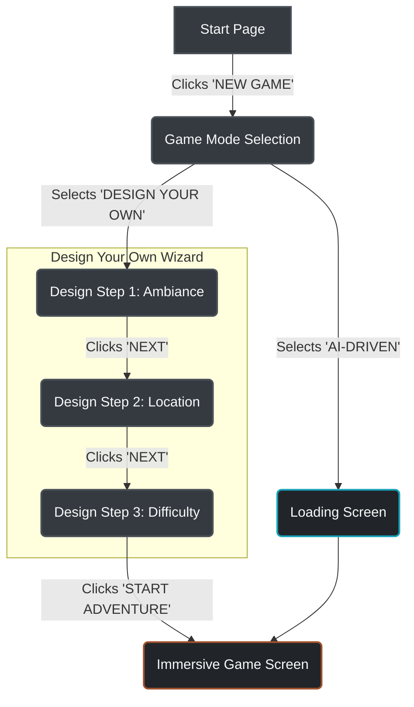

# AI Escape - UX Design Specification

**Version:** 0.1.0
**Date:** 2025-11-20
**Author:** Sally, UX Designer

## 1. Core Experience

- **Defining Experience:** A retro-futuristic, text-based adventure game where players can either craft their own journey or have one generated by an AI. The core interaction is text-based, supported by an immersive visual and atmospheric interface.
- **Core Principles:**
    - **Immersion:** The UI should support the narrative, not distract from it. Dark themes, atmospheric backgrounds, and focused content areas are key.
    - **Clarity:** Game status (Objective, Inventory, Hints) should be instantly understandable.
    - **Guidance:** The interface should guide the user through complex choices (like game setup) in a simple, step-by-step manner.

---

## 2. Visual Foundation

### 2.1. Color System

The color palette establishes a retro-futuristic, gritty, and immersive atmosphere.

| Role                  | Variable              | Hex Code  | Usage                               |
| --------------------- | --------------------- | --------- | ----------------------------------- |
| **Primary**           | `--color-primary`     | `#F8F9FA` | Main text, important UI elements.   |
| **Secondary**         | `--color-secondary`   | `#8B4513` | (Currently unused, available for UI) |
| **Accent**            | `--color-accent`      | `#A0522D` | Clickable items, highlights, CTAs.  |
| **Info**              | `--color-info`        | `#17A2B8` | Informational messages, cooldowns.  |
| **Background**        | `--color-background`  | `#212529` | Main background color.              |
| **Surface**           | `--color-surface`     | `#343A40` | Cards, modals, button backgrounds.  |
| **Border**            | `--color-border`      | `#495057` | Borders, dividers.                  |
| **Text Primary**      | `--color-text-primary`| `#F8F9FA` | Primary content text.               |
| **Text Secondary**    | `--color-text-secondary`| `#ADB5BD` | Secondary/hint text.                |

### 2.2. Typography

The typography is chosen to be thematic and readable.

- **Heading Font:** `Press Start 2P`
  - **Usage:** Main titles (`<h1>`), section headers (`<h3>`), and other key display text. It provides the retro, pixelated game feel.
- **Body Font:** `Roboto Mono`
  - **Usage:** All other text, including paragraphs, buttons, and UI labels. Its monospaced nature enhances the "computer terminal" aesthetic while being highly readable.

### 2.3. Spacing & Layout

A consistent spacing system should be used to ensure a clean and organized layout.

- **Base Unit:** `1rem` (typically 16px).
- **Scale:** Spacing is applied in multiples of the base unit (`0.5rem`, `1rem`, `1.5rem`, `2rem`, `4rem`).
- **Layout:** The main layout is a single-column, centered container with a `max-width` of `1400px`. The immersive game screen uses a two-column grid.

---

## 3. Responsive Design Strategy

The application must be usable and aesthetically pleasing across multiple devices.

- **Breakpoints:**
  - **Mobile:** `< 768px`
  - **Tablet:** `768px - 1024px`
  - **Desktop:** `> 1024px`

- **Adaptation Patterns:**
  - **Mobile (`< 768px`):**
    - The immersive screen's two-column layout will stack vertically: `immersive-main` on top, `immersive-sidebar` on the bottom.
    - Font sizes may be slightly reduced to improve content density.
    - Padding and margins will be reduced.
    - The multi-step design wizard options will stack vertically instead of horizontally.
  - **Tablet (`768px - 1024px`):**
    - Layouts will be similar to desktop but with reduced padding and margins. The two-column layout will be preserved.

---

## 4. Accessibility Strategy

- **Compliance Target:** WCAG 2.1 Level AA.
- **Color Contrast:** All text must meet a minimum contrast ratio of 4.5:1 against its background. A formal audit will be required.
- **Keyboard Navigation:** All interactive elements (buttons, links, inputs) must be reachable and operable via the keyboard alone. Focus order must be logical.
- **Focus Indicators:** Custom, highly visible focus indicators will be designed to replace default browser outlines, ensuring they are clear against the dark background.
- **ARIA Roles:** Appropriate ARIA roles and attributes will be used for custom components (like the hint box) to communicate their state to screen readers.

---

## 5. User Journey Flows

This section documents the primary user flows through the application.

### 5.1. New Game Creation

This flow covers the user's journey from starting the application to beginning a new game, either by designing it themselves or by letting the AI generate it.

---

## 6. Component Library

This section specifies the reusable components that form the building blocks of the AI Escape interface.

### 6.1. Action Button (`.action-btn`)

- **Purpose:** To allow users to confirm a choice, proceed to the next step, or trigger a primary action.
- **Content:** Displays a short, all-caps text label (e.g., "NEXT", "BACK").
- **User Actions:** Click.
- **Variants:**
    - **Default (`.action-btn`):** Used for secondary actions, like navigating "BACK".
    - **Primary (`.action-btn.primary`):** Used for the primary, forward-moving action in a sequence (e.g., "NEXT", "START ADVENTURE").
- **States:**
    - **Default:** Dark surface background (`--color-surface`) with a subtle border.
    - **Hover:** Accent color background (`--color-accent`) with dark text.
    - **Active/Click:** (Same as hover).
    - **Disabled:** (Not yet designed, would need a muted style with `cursor: not-allowed`).
- **Accessibility:**
    - Must have a visible focus indicator.
    - Text label should be descriptive of the action.

### 6.2. Status Box (`.status-box`)

- **Purpose:** To display key game information to the user in a clear, organized manner within the sidebar.
- **Content:** Contains a `<h4>` for the title (e.g., "OBJECTIVE") and either a `
` for text or a `<ul>` for a list of items.
- **User Actions:** None by default. See Hint Box variant for interactive version.
- **Variants:**
    - **Default:** Standard non-interactive info box.
    - **Hint Box (`#hint-box`):** A clickable variant that reveals a hint and has a cooldown mechanism.
- **States (for Hint Box variant):**
    - **Default:** Standard appearance, `cursor: pointer`.
    - **Hover:** Border color and background change to indicate interactivity.
    - **Disabled:** Muted appearance, `cursor: not-allowed`. Used when no hints are available or during cooldown.
- **Accessibility:**
    - The `<h4>` provides a clear heading for the content.
    - For the interactive hint box, ARIA attributes should be used to announce its state (e.g., `aria-disabled`).

### 6.3. Option Button (`.option-btn`)

- **Purpose:** To allow users to select from a set of choices, such as ambiance, location, or difficulty.
- **Content:** Displays a short text label.
- **User Actions:** Click to select.
- **Variants:**
    - **Default:** A standard button for simple choices (e.g., "SCARY", "NORMAL").
    - **Large (`.option-btn.large`):** A larger button with a title and descriptive paragraph, used for major choices like game mode.
- **States:**
    - **Default:** Dark surface background (`--color-surface`).
    - **Hover:** Accent color background (`--color-accent`).
    - **Active (`.active`):** Accent color background to indicate the currently selected option.
- **Accessibility:**
    - When used as a group, should be contained within a `radiogroup` or similar structure.
    - The `.active` state must be programmatically communicated (e.g., `aria-checked="true"`).
