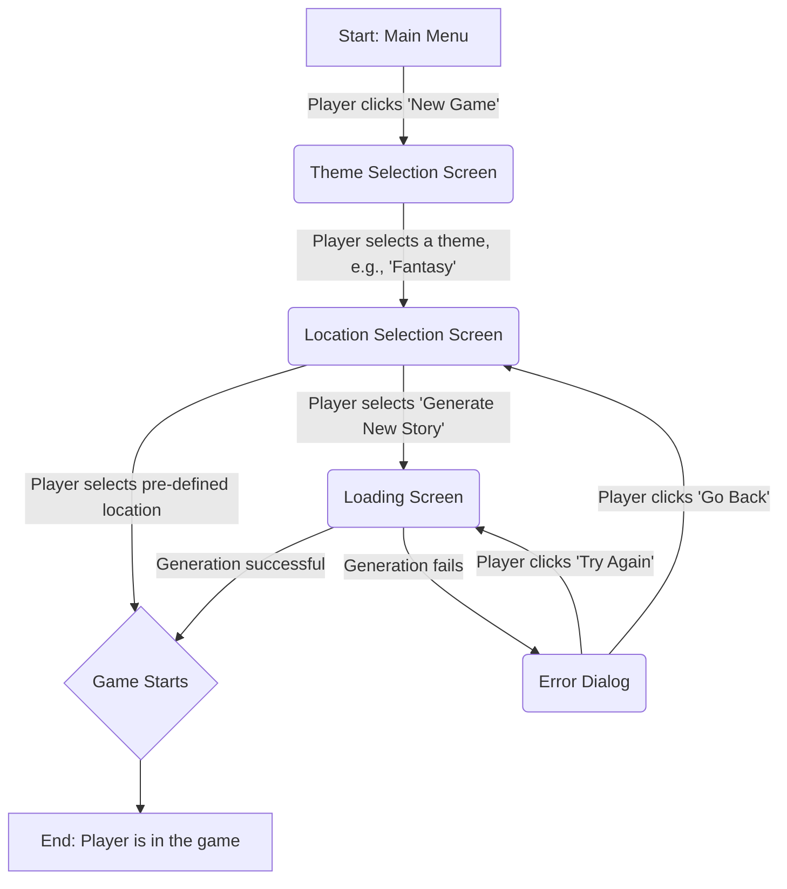

# ibe160 UX Design Specification

_Created on Friday, 14 November 2025 by BIP_
_Generated using BMad Method - Create UX Design Workflow v1.0_

---

## Executive Summary

The project vision is to create a game, "AI Escape," where players can start a new, unique adventure that feels fresh and compelling every time they play, leveraging AI-driven replayability.

---

## 1. Design System Foundation

### 1.1 Design System Choice

**System:** shadcn/ui
**Version:** Latest stable version
**Rationale:** Chosen for its balance of accessibility, developer control, and creative freedom, allowing for a unique visual identity for "AI Escape" without being locked into a prescriptive design language. It provides unstyled, accessible components that are highly customizable with Tailwind CSS.
**Provides:** A robust library of accessible, unstyled UI components (e.g., buttons, forms, modals, navigation elements).
**Customization Needs:** High, to achieve the unique, immersive game aesthetic and interaction patterns required for "AI Escape."

---

## 2. Core User Experience

### 2.1 Defining Experience

**Core Experience Principles:**

*   **Speed:** The standard game setup will be fast and intuitive. The "completely generate a new story" option will be intentionally slower to create a sense of anticipation and uniqueness.
*   **Guidance:** We'll provide clear choices during setup, but the puzzles themselves will be challenging with minimal hand-holding. The "Help" system will be a safety net, not a primary guide.
*   **Flexibility:** Players will have a high degree of control over the game's theme and location, but the AI will guide the narrative and puzzle progression within a structured framework to ensure coherence.
*   **Feedback:** Feedback will be rich and immersive, from a "delightful" loading screen to clear and satisfying feedback when solving puzzles.

### 2.2 Novel UX Patterns

**Pattern Name:** AI-Driven Replayability

**User Goal:** To start a new, unique adventure that feels fresh and compelling.

**Trigger:** A "New Game" button on the main menu.

**Interaction Flow:**
1.  User selects "New Game."
2.  User is presented with a choice of themes/feelings (e.g., "Mystery," "Sci-Fi," "Fantasy").
3.  User is presented with a choice of pre-defined locations based on the theme, OR an option to "Completely generate a new story and location."
4.  If the user chooses to generate, a loading screen appears with intriguing quotes, jokes, or hints, indicating that the AI is crafting a unique world.

**Visual Feedback:** The loading screen will visually communicate that a unique world is being built.

**States:**
*   **Default:** Main menu with "New Game," "Continue Game," "Load Game," "Options," and "Help."
*   **Loading:** A loading screen with quotes/jokes/hints.
*   **Success:** The game begins with the chosen or generated theme and location.
*   **Error:** If generation fails, a dialog appears with options to "Try Again" or "Go Back" to the selection screen.

**Platform Considerations:** The layout will adapt from horizontal on desktop/web to vertical on mobile web.

**Accessibility:** All buttons and choices will be keyboard-navigable and screen-reader compatible.

**Inspiration:** The setup flow is inspired by common patterns in many games, while the loading screen experience is inspired by *The Sims 4*. The "generate a new world" option is similar to using "seeds" in games like *Minecraft*.

---

## 3. Visual Foundation

### 3.1 Color System

**Theme:** Retro-Futuristic Grit (Dark Mode)
**Rationale:** Inspired by "The Oregon Trail" and adapted for a modern, AI-driven game, this theme evokes a sense of ruggedness, challenge, and technological mystery. The dark background enhances immersion and focus.

**Color Palette:**
*   **Primary:** `#F8F9FA` (Light Grey) - Used for primary text and key elements.
*   **Secondary:** `#8B4513` (Saddle Brown) - Used for secondary actions and earthy, historical accents.
*   **Accent:** `#D2691E` (Chocolate/Rust) - Used for subtle tech/futuristic highlights and interactive elements, evoking a weathered, adventurous feel.
*   **Success:** `#28A745` (Green) - Used for success messages and positive feedback.
*   **Warning:** `#FFC107` (Amber) - Used for warnings and cautionary messages.
*   **Error:** `#DC3545` (Red) - Used for error messages and destructive actions.
*   **Info:** `#17A2B8` (Info Blue) - Used for informational messages and hints.
*   **Background:** `#212529` (Darkest Grey) - The primary background color for the application.
*   **Borders:** `#343A40` (Darker Grey) - Used for borders and separators.

### 3.2 Typography

*   **Heading Font:** 'Press Start 2P', cursive - Provides a pixelated, retro feel for headings.
*   **Body Font:** 'Roboto Mono', monospace - Offers a clean, technical feel for body text and game commands, enhancing readability.
*   **Type Scale:** A standard, responsive type scale will be used for headings (h1-h6), body text, and smaller captions to ensure a clear visual hierarchy.

### 3.3 Spacing & Layout

*   **Base Unit:** 8px - All spacing and sizing will be based on an 8px grid for consistency.
*   **Spacing Scale:** A consistent spacing scale (e.g., 4px, 8px, 12px, 16px, 24px) will be used for margins, padding, and layout composition.
*   **Layout Grid:** A standard 12-column grid will be used for web and desktop layouts to ensure proper alignment and responsive behavior.

**Interactive Visualizations:**

- Color Theme Explorer: [ux-color-themes.html](./ux-color-themes.html)

---

## 4. Design Direction

### 4.1 Chosen Design Approach

**Chosen Direction:** Direction 5: Immersive Adventure

**Description:** This direction combines a full-screen immersive background with an organized sidebar and a semi-transparent text overlay. It aims to provide both atmospheric immersion and clear, at-a-glance information.

**Key Features:**
*   Full-screen background image for deep immersion.
*   Semi-transparent dark text box overlay for story and options, ensuring readability without fully obscuring the background.
*   Right-side vertical sidebar for "Game Status" (Inventory, Objectives, Hint, Options, Save), providing quick access to critical information.
*   The accent color is used for interactive elements and highlights, maintaining the retro-futuristic grit theme.

**Interactive Mockups:**

- Design Direction Showcase: [ux-design-directions.html](./ux-design-directions.html)

---

## 5. Information Architecture

### 5.1 High-Level Structure

The application's information architecture is structured to provide intuitive navigation and access to core game functionalities and information.

**Main Menu:**
*   **New Game:** Initiates the AI-Driven Replayability flow, allowing users to start a fresh, unique adventure.
*   **Continue Game:** Resumes the last saved game session.
*   **Load Game:** Provides access to a list of saved game states for selection.
*   **Options:** Navigates to game settings (audio, display, controls, accessibility).
*   **Help:** Accesses in-game assistance, tutorials, and lore.

**In-Game Screen:**
*   **Immersive Main Area:** The primary display for the game's narrative, puzzles, and interactive choices. This area is dynamic and driven by the AI.
*   **Right Sidebar (Game Status):** A persistent vertical sidebar providing at-a-glance information and quick access to essential game features.
    *   **Inventory:** Displays items collected by the player.
    *   **Objectives:** Shows current goals and tasks.
    *   **Hint:** Provides contextual hints for puzzles (limited use).
    *   **Options:** Quick access to game settings without leaving the game screen.
    *   **Save:** Allows players to save their current game progress.

**Options Screen:**
*   **Audio Settings:** Volume controls for music, sound effects, and dialogue.
*   **Display Settings:** Resolution, full-screen/windowed mode, graphics quality.
*   **Controls:** Keybindings and input device settings.
*   **Accessibility:** Options for color blindness, text size, narration, etc.
*   **Save/Apply:** Confirms and applies changes.
*   **Back to Main Menu / Back to Game:** Returns to the previous screen.

**Help Screen:**
*   **How to Play:** Basic game instructions and mechanics.
*   **Game Mechanics:** Detailed explanations of puzzle types, interaction models, etc.
*   **Lore/Background:** Information about the game world and story.
*   **FAQ:** Frequently asked questions.
*   **Back to Main Menu / Back to Game:** Returns to the previous screen.

**Load/Save Game Screens:**
*   **List of Save Slots:** Displays available save files with details (e.g., date, location, progress).
*   **Save Button:** Saves the current game to a selected slot.
*   **Load Button:** Loads a selected game state.
*   **Delete Save:** Removes a selected save file.
*   **Back to Main Menu / Back to Game:** Returns to the previous screen.

---

## 6. Component Library

### 6.1 Component Strategy

The project will leverage `shadcn/ui` as its foundational component library, customizing its unstyled, accessible components with Tailwind CSS to achieve the unique "Retro-Futuristic Grit" aesthetic.

#### Key Components for AI-Driven Replayability Flow:

-   **Button:**
    -   **Purpose:** To trigger actions such as "New Game," "Select Theme," "Select Location," "Generate New Story," "Try Again," and "Go Back."
    -   **Usage:** Will adhere to the defined Button Hierarchy (Primary, Secondary, Destructive) for clear visual communication of action importance.
    -   **Customization:** Styling will align with the Retro-Futuristic Grit theme, including font, color, and subtle hover/active states.
-   **Dialog:**
    -   **Purpose:** To display error messages (e.g., if AI generation fails) or critical confirmations.
    -   **Usage:** Will be used for the "Error" state in the AI-Driven Replayability flow, offering "Try Again" and "Go Back" options.
    -   **Customization:** The dialog will be styled to fit the overall theme, ensuring readability against the game background.
-   **Card:**
    -   **Purpose:** To present selectable options such as themes and locations in a visually distinct and organized manner.
    -   **Usage:** Will be used in the Theme Selection Screen and Location Selection Screen to display available choices.
    -   **Customization:** Cards will feature thematic borders, background textures, and clear typography to enhance the immersive experience.
-   **Loading Spinner/Animation:**
    -   **Purpose:** To provide visual feedback during asynchronous operations, particularly during the "Generate New Story" process.
    -   **Usage:** A subtle, thematic loading animation will be used for quick loading states. For the longer "Generate New Story" process, the dedicated immersive loading screen (as defined in UX Patterns) will be used.
    -   **Customization:** The visual style of the spinner/animation will be consistent with the retro-futuristic aesthetic.

---

## 7. UX Pattern Decisions

### 7.1 Consistency Rules

To ensure a predictable and intuitive experience, the following UX patterns will be applied consistently across the application.

#### 1. Button Hierarchy

-   **Primary Button:** Used for the main, most common action on a screen (e.g., "Continue", "Confirm", "Choose").
    -   **Style:** High-contrast button that draws the user's eye. Uses the primary color (`#F8F9FA` with dark text).
-   **Secondary Button:** Used for secondary actions that are less important than the primary action (e.g., "Go Back", "Cancel").
    -   **Style:** Visually less prominent. Uses the secondary color (`#8B4513` with light text).
-   **Tertiary/Ghost Button:** Used for less prominent actions, often within a list or card (e.g., "Learn More", "Details").
    -   **Style:** A simple text link with an underline on hover, or a transparent button with a border.
-   **Destructive Button:** Used for actions that delete data or have significant consequences (e.g., "Delete Save", "Exit without Saving").
    -   **Style:** Uses the error color (`#DC3545` with light text) to clearly indicate a destructive action.

#### 2. Feedback Patterns

-   **Success:** A clear, concise, and non-intrusive message with a checkmark icon, using the success color (`#28A745`). It should fade out after a few seconds.
-   **Error:** A persistent message that clearly explains the error and how to fix it, using the error color (`#DC3545`). It should remain visible until the user resolves the error.
-   **Warning:** A dismissible message that alerts the user to a potential issue, using the warning color (`#FFC107`).
-   **Info:** A dismissible, helpful tip or piece of information, using the info color (`#17A2B8`).
-   **Loading:**
    -   For quick actions: A spinner or pulsing animation on the button that was clicked.
    -   For longer actions (like generating a new world): The dedicated immersive loading screen with quotes/jokes/hints.

#### 3. Form Patterns (e.g., for character name input)

-   **Labels:** Placed above the input field for clarity.
-   **Validation:** Validation occurs on form submission to avoid interrupting the user while typing.
-   **Errors:** A clear error message is displayed below the input field with the error, using the error color. The input field's border will also change to the error color.
-   **Help Text:** A small, secondary-colored text below the input field to provide additional context or instructions.

---

## 8. User Journey Flows

### 8.1 New Game (AI-Driven Replayability)

**Goal:** To start a new, unique adventure that feels fresh and compelling.

**Actor:** Player

**Trigger:** Player selects "New Game" from the main menu.

**Flow:**

**Steps:**

1.  **Main Menu:** The player is on the main menu screen.
    -   *Action:* The player clicks the "New Game" button.
2.  **Theme Selection Screen:** The player is presented with a choice of themes or genres (e.g., "Mystery," "Sci-Fi," "Fantasy").
    -   *Action:* The player selects a theme.
3.  **Location Selection Screen:** Based on the chosen theme, the player is presented with a list of pre-defined locations, plus an option to "Completely generate a new story and location."
    -   *Action (Path A):* The player selects a pre-defined location. The game starts immediately (Proceed to Step 5).
    -   *Action (Path B):* The player selects "Completely generate a new story and location."
4.  **Loading Screen (Generation):** If the player chose to generate a new story, a loading screen appears.
    -   *Feedback:* The screen displays intriguing quotes, jokes, or hints to engage the player while the AI crafts the unique world. This visually communicates that a unique world is being built.
    -   *Success:* The game world is generated successfully.
    -   *Failure:* An error occurs during generation. An error dialog is displayed with options to "Try Again" or "Go Back" to the location selection screen.
5.  **Game Start:** The game begins, placing the player in the chosen or newly generated environment.

---

## 9. Responsive Design & Accessibility

### 9.1 Responsive Strategy

The application will be designed with a mobile-first approach, ensuring a seamless and optimized experience across various devices and screen sizes.

#### 1. Breakpoints

-   **Mobile:** Up to 767px (e.g., `sm` in Tailwind CSS)
-   **Tablet:** 768px to 1023px (e.g., `md` in Tailwind CSS)
-   **Desktop:** 1024px and above (e.g., `lg` in Tailwind CSS)

#### 2. Adaptation Patterns

-   **Layouts:** Multi-column layouts will collapse to single-column stacks on mobile. Grids will adapt to lists or fewer columns as screen size decreases.
-   **Content Prioritization:** Essential information will be prioritized and displayed prominently on smaller screens, with secondary information potentially hidden behind toggles or moved to secondary views.
-   **Text Scaling:** Font sizes will scale appropriately across breakpoints to maintain readability.

#### 3. Navigation Adaptation

-   **Desktop:** Full navigation menu (e.g., "New Game," "Continue," "Options") will be visible.
-   **Mobile/Tablet:** Navigation will collapse into a hamburger menu or similar pattern to conserve screen space. Essential in-game navigation (e.g., "Inventory," "Objectives") within the sidebar will remain accessible or adapt to a tab-bar pattern.

#### 4. Touch Targets

-   All interactive elements (buttons, links, form fields) will have a minimum touch target size of 44x44 pixels on mobile devices to ensure ease of use and prevent accidental taps.

### 9.2 Accessibility Considerations

The application will strive for **WCAG 2.1 Level AA** compliance to ensure a robust and inclusive user experience.

#### 1. Color Contrast Requirements

-   **Normal Text:** A minimum contrast ratio of **4.5:1** will be maintained for all normal-sized text against its background.
-   **Large Text (18pt or 14pt bold):** A minimum contrast ratio of **3:1** will be maintained for large text against its background.
-   **Interactive Elements:** A minimum contrast ratio of **3:1** will be ensured for UI components and graphical objects that convey information.

#### 2. Keyboard Navigation

-   All interactive elements (buttons, links, form fields, menu items, etc.) will be fully navigable and operable using only the keyboard (e.g., `Tab`, `Shift+Tab`, `Enter`, `Space`).
-   The keyboard focus order will be logical and follow the visual flow of the page.

#### 3. Focus Indicators

-   A clear and visible focus indicator (e.g., a distinct outline or a change in background color with sufficient contrast) will be provided for all interactive elements when they receive keyboard focus.

#### 4. ARIA Requirements

-   ARIA (Accessible Rich Internet Applications) roles, states, and properties will be used where necessary to enhance the semantic meaning of custom UI components and dynamic content for assistive technologies.
-   Examples include `role="dialog"` for modals, `aria-live` regions for dynamic content updates, and `aria-label` for descriptive labels where visual text is insufficient.

#### 5. Screen Reader Considerations

-   All interactive elements and meaningful content will have clear, concise, and descriptive labels accessible to screen readers.
-   The HTML structure will be semantic and logical to ensure a coherent experience for screen reader users.
-   Dynamic content changes will be announced to screen readers using appropriate ARIA live regions.

#### 6. Alt Text Strategy

-   All meaningful images (i.e., images that convey information or are critical to understanding the content) will be provided with descriptive `alt` text.
-   Decorative images (i.e., images that do not convey information and are purely for aesthetic purposes) will have empty `alt` attributes (`alt=""`).

#### 7. Form Accessibility

-   All form input fields will have programmatically associated labels using the `<label for="id">` attribute.
-   Error messages will be clearly associated with their respective input fields, and their presence will be communicated to assistive technologies.

#### 8. Testing Strategy

-   **Automated Testing:** Automated accessibility testing tools (e.g., Axe, Lighthouse) will be integrated into the development workflow to identify and address common accessibility issues early.
-   **Manual Testing:** Regular manual accessibility testing will be conducted, including:
    -   Keyboard-only navigation testing.
    -   Testing with various screen readers (e.g., NVDA, JAWS, VoiceOver) to ensure a comprehensive user experience.

---

## 10. Implementation Guidance

### 10.1 Completion Summary

This UX Design Specification provides a solid foundation for the 'AI Escape' project. We have defined the core project vision, established a design system based on `shadcn/ui`, articulated core experience principles, and detailed a novel AI-Driven Replayability UX pattern. Key UX patterns for buttons, feedback, and forms have been established, along with a comprehensive responsive design strategy and accessibility considerations targeting WCAG 2.1 Level AA. While the core structure and many critical details are now in place, further refinement is needed, particularly in expanding the design direction mockups and detailing out all user journey flows beyond the initial 'New Game' flow. The document is now ready to guide initial implementation efforts, with an understanding that further UX design iterations will be required for comprehensive coverage.

---

## 11. Appendix

### Related Documents

- Product Requirements: `prd.md`
- Product Brief: `product-brief-AI Escape-2025-11-10.md`
- Brainstorming: `brainstorming-session-results-2025-10-30.md`

### Core Interactive Deliverables

This UX Design Specification was created through visual collaboration:

- **Color Theme Visualizer**: `ux-color-themes.html`
  - Interactive HTML showing all color theme options explored
  - Live UI component examples in each theme
  - Side-by-side comparison and semantic color usage

- **Design Direction Mockups**: `ux-design-directions.html`
  - Interactive HTML with 6-8 complete design approaches
  - Full-screen mockups of key screens
  - Design philosophy and rationale for each direction

### Optional Enhancement Deliverables

_This section will be populated if additional UX artifacts are generated through follow-up workflows._

<!-- Additional deliverables added here by other workflows -->

### Next Steps & Follow-Up Workflows

This UX Design Specification can serve as input to:

- **Wireframe Generation Workflow** - Create detailed wireframes from user flows
- **Figma Design Workflow** - Generate Figma files via MCP integration
- **Interactive Prototype Workflow** - Build clickable HTML prototypes
- **Component Showcase Workflow** - Create interactive component library
- **AI Frontend Prompt Workflow** - Generate prompts for v0, Lovable, Bolt, etc.
- **Solution Architecture Workflow** - Define technical architecture with UX context

### Version History

| Date     | Version | Changes                         | Author        |
| -------- | ------- | ------------------------------- | ------------- |
| Friday, 14 November 2025 | 1.0     | Initial UX Design Specification | BIP |

---

_This UX Design Specification was created through collaborative design facilitation, not template generation. All decisions were made with user input and are documented with rationale._
