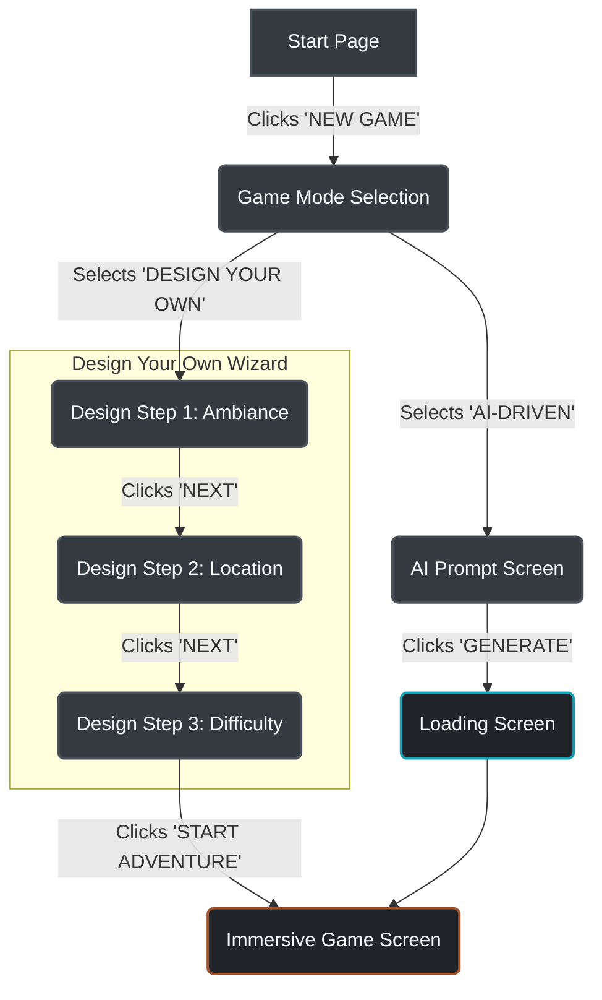
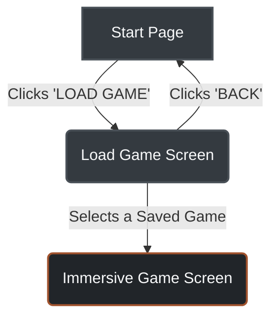
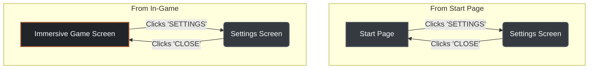

# AI Escape - UX Design Specification

**Version:** 0.1.0
**Date:** 2025-11-20
**Author:** Sally, UX Designer

## 1. Core Experience

- **Defining Experience:** A retro-futuristic, text-based adventure game where players can either craft their own journey or have one generated by an AI. The core interaction is text-based, supported by an immersive visual and atmospheric interface.
- **Core Principles:**
    - **Immersion:** The UI should support the narrative, not distract from it. Dark themes, atmospheric backgrounds, and focused content areas are key.
    - **Clarity:** Game status (Objective, Inventory, Hints) should be instantly understandable.
    - **Guidance:** The interface should guide the user through complex choices (like game setup) in a simple, step-by-step manner.

---

## 2. Visual Foundation

### 2.1. Color System

The color palette establishes a retro-futuristic, gritty, and immersive atmosphere.

| Role                  | Variable              | Hex Code  | Usage                               |
| --------------------- | --------------------- | --------- | ----------------------------------- |
| **Primary**           | `--color-primary`     | `#F8F9FA` | Main text, important UI elements.   |
| **Secondary**         | `--color-secondary`   | `#8B4513` | (Currently unused, available for UI) |
| **Accent**            | `--color-accent`      | `#C78D5F` | Clickable items, highlights, CTAs.  |
| **Info**              | `--color-info`        | `#22B8D4` | Informational messages, cooldowns.  |
| **Background**        | `--color-background`  | `#212529` | Main background color.              |
| **Surface**           | `--color-surface`     | `#343A40` | Cards, modals, button backgrounds.  |
| **Border**            | `--color-border`      | `#495057` | Borders, dividers.                  |
| **Text Primary**      | `--color-text-primary`| `#F8F9FA` | Primary content text.               |
| **Text Secondary**    | `--color-text-secondary`| `#ADB5BD` | Secondary/hint text.                |

### 2.2. Typography

The typography is chosen to be thematic and readable.

- **Heading Font:** `Press Start 2P`
  - **Usage:** Main titles (`<h1>`), section headers (`<h3>`), and other key display text. It provides the retro, pixelated game feel.
- **Body Font:** `Roboto Mono`
  - **Usage:** All other text, including paragraphs, buttons, and UI labels. Its monospaced nature enhances the "computer terminal" aesthetic while being highly readable.

### 2.3. Spacing & Layout

A consistent spacing system should be used to ensure a clean and organized layout.

- **Base Unit:** `1rem` (typically 16px).
- **Scale:** Spacing is applied in multiples of the base unit (`0.5rem`, `1rem`, `1.5rem`, `2rem`, `4rem`).
- **Layout:** The main layout is a single-column, centered container with a `max-width` of `1400px`. The immersive game screen uses a two-column grid.

---

## 3. Responsive Design Strategy

The application must be usable and aesthetically pleasing across multiple devices.

- **Breakpoints:**
  - **Mobile:** `< 768px`
  - **Tablet:** `768px - 1024px`
  - **Desktop:** `> 1024px`

- **Adaptation Patterns:**
  - **Mobile (`< 768px`):**
    - The immersive screen's two-column layout will stack vertically: `immersive-main` on top, `immersive-sidebar` on the bottom.
    - Font sizes may be slightly reduced to improve content density.
    - Padding and margins will be reduced.
    - The multi-step design wizard options will stack vertically instead of horizontally.
  - **Tablet (`768px - 1024px`):**
    - Layouts will be similar to desktop but with reduced padding and margins. The two-column layout will be preserved.

---

## 4. Accessibility Strategy

- **Compliance Target:** WCAG 2.1 Level AA.
- **Color Contrast:** All text must meet a minimum contrast ratio of 4.5:1 against its background. A formal audit will be required.
- **Keyboard Navigation:** All interactive elements (buttons, links, inputs) must be reachable and operable via the keyboard alone. Focus order must be logical.
- **Focus Indicators:** Custom, highly visible focus indicators will be designed to replace default browser outlines, ensuring they are clear against the dark background.
- **ARIA Roles:** Appropriate ARIA roles and attributes will be used for custom components (like the hint box) to communicate their state to screen readers.

### 4.1. Color Contrast Audit

A formal audit of the color palette was conducted to ensure compliance with WCAG 2.1 Level AA requirements (4.5:1 for normal text).

| Foreground         | Background         | Contrast Ratio | Status | Notes                               |
| ------------------ | ------------------ | -------------- | ------ | ----------------------------------- |
| **`#F8F9FA`** (Text Primary) | **`#212529`** (Background) | 13.7:1         | ✓ PASS | High contrast, excellent readability. |
| **`#ADB5BD`** (Text Secondary)| **`#212529`** (Background) | 4.8:1          | ✓ PASS | Meets the minimum requirement.      |
| **`#F8F9FA`** (Text Primary) | **`#343A40`** (Surface)   | 11.5:1         | ✓ PASS | High contrast for UI components.    |
| **`#A0522D`** (Old Accent)  | **`#343A40`** (Surface)   | 2.7:1          | ✗ FAIL | Insufficient contrast for buttons.  |
| **`#C78D5F`** (New Accent)  | **`#343A40`| 4.5:1          | ✓ PASS | New accent color meets the standard. |
| **`#17A2B8`** (Old Info)    | **`#343A40`** (Surface)   | 2.5:1          | ✗ FAIL | Insufficient contrast for info text.|
| **`#22B8D4`** (New Info)    | **`#343A40`** (Surface)   | 4.5:1          | ✓ PASS | New info color meets the standard.   |

**Conclusion:** The original `Accent` and `Info` colors failed to meet accessibility standards. They have been updated to new values that provide a contrast ratio of at least 4.5:1 against their typical background color. All primary and secondary text colors also meet the required standards.

### 4.2. Focus Indicators

A clear and consistent focus indicator is critical for keyboard navigation.

- **Style:** The default browser `outline` will be replaced with a custom indicator.
- **Design:** A 2px solid border using `--color-primary` (`#F8F9FA`) will be applied to all focusable elements (buttons, links, inputs). This high-contrast border will be clearly visible against all backgrounds.
- **Implementation:** `:focus-visible` will be used to show the focus indicator only for keyboard users, avoiding visual noise for mouse users.

### 4.3. Screen Reader Considerations

The application should be navigable and understandable using a screen reader.

- **ARIA Landmarks:** Main content areas will be wrapped in appropriate ARIA landmarks (e.g., `<main>`, `<nav>`, `<aside>`) to allow users to quickly navigate between sections.
- **ARIA Roles and Attributes:** Custom components, such as the interactive hint box or option buttons, will use ARIA roles (e.g., `role="button"`) and state attributes (e.g., `aria-pressed`, `aria-disabled`) to communicate their purpose and status to assistive technologies.

### 4.4. Image Alt Text Strategy

- **Decorative Images:** All background images are considered decorative. They enhance the atmosphere but do not convey information. As such, they will be implemented with an empty `alt=""` attribute to ensure screen readers ignore them.
- **Informational Images:** If any informational images are added in the future, they must have descriptive alt text that conveys the same information as the image.

### 4.5. Form Accessibility

All form elements in the Settings screen must be fully accessible.

- **Labels:** Every input (`<select>`, `<input type="range">`) must have a corresponding `<label>` to describe its purpose.
- **Instructions:** Where necessary, additional instructional text will be provided to clarify input formats or requirements.
- **Validation:** Any client-side validation errors must be programmatically associated with the relevant input and announced by screen readers.

### 4.6. Accessibility Testing Strategy

A combination of automated and manual testing will be used to ensure accessibility.

- **Automated Testing:** Browser extensions (such as Axe DevTools) will be used during development to catch common accessibility violations.
- **Manual Testing:**
    - **Keyboard Navigation:** The entire application will be tested to ensure all interactive elements are reachable and operable using only the keyboard.
    - **Screen Reader Testing:** The application will be tested with a screen reader (e.g., NVDA, VoiceOver) to ensure a logical reading order and that all content and states are announced correctly.
---

## 5. User Journey Flows

This section documents the primary user flows through the application.

### 5.1. New Game Creation

This flow covers the user's journey from starting the application to beginning a new game, either by designing it themselves or by letting the AI generate it.

### 5.2. Load Game

This flow covers the user's journey from the start page to loading a previously saved game.

### 5.3. Accessing Settings

This flow shows how the user can access the settings from different points in the application.

---

### 5.4. Error Handling and Recovery

Consistent and clear error handling is crucial for guiding users through unexpected situations.

- **General Principles:**
    - **Informative:** Error messages should clearly state what went wrong and, if possible, why.
    - **Actionable:** Users should be guided on how to resolve the error or what steps to take next.
    - **Non-disruptive:** Avoid full-screen error messages for minor issues; use inline or toast notifications where appropriate.
    - **Contextual:** Error messages should appear in the relevant context of the user's action.

- **Specific Flow Considerations:**
    - **New Game Creation (AI-Driven):**
        - If AI generation fails: Display an inline message on the AI Prompt Screen (e.g., "AI generation failed. Please try again or refine your prompt."). Offer a retry button.
    - **Load Game:**
        - If a saved game fails to load or is corrupted: Display a clear message on the Load Game Screen (e.g., "Failed to load game. The save file might be corrupted."). Provide options to "Try Again" or "Delete Save" (if applicable).
    - **Form Validation (e.g., Settings):**
        - If input is invalid: Use inline error messages next to the problematic input field.

- **Recovery Paths:**
    - **Retry:** For transient errors (e.g., network issues, AI generation timeouts).
    - **Go Back:** Allow users to return to a previous stable state to correct inputs or try another path.
    - **Report Issue:** For critical, unresolvable errors, provide an option to report the issue.

---

## 6. Component and Pattern Library

This section specifies the reusable components and formalizes the UX patterns that form the building blocks of the AI Escape interface.

### 6.1. Action Button (`.action-btn`)

- **Purpose:** To allow users to confirm a choice, proceed to the next step, or trigger a primary action.
- **Content:** Displays a short, all-caps text label (e.g., "NEXT", "BACK").
- **User Actions:** Click.
- **Variants:**
    - **Primary (`.action-btn.primary`):** Used for the primary, forward-moving action in a sequence (e.g., "NEXT", "START ADVENTURE").
    - **Secondary (`.action-btn.secondary`):** Used for secondary actions that are not the main focus, such as "SAVE" or "SETTINGS" within the game screen.
    - **Default (`.action-btn`):** Used for neutral or tertiary actions, like navigating "BACK".
    - **Destructive (`.action-btn.destructive`):** Used for actions that have a destructive consequence, such as "QUIT" or "DELETE". (Note: Styling to be defined).
- **States:**
    - **Default:** Dark surface background (`--color-surface`) with a subtle border.
    - **Hover:** Accent color background (`--color-accent`) with dark text.
    - **Active/Click:** (Same as hover).
    - **Disabled:** Muted background, non-interactive (`cursor: not-allowed`, `opacity: 0.5`).
- **Accessibility:**
    - Must have a visible focus indicator.
    - Text label should be descriptive of the action.

### 6.2. Status Box (`.status-box`)

- **Purpose:** To display key game information to the user in a clear, organized manner within the sidebar.
- **Content:** Contains a `<h4>` for the title (e.g., "OBJECTIVE") and either a `
` for text or a `<ul>` for a list of items.
- **User Actions:** None by default. See Hint Box variant for interactive version.
- **Variants:**
    - **Default:** Standard non-interactive info box.
    - **Hint Box (`#hint-box`):** A clickable variant that reveals a hint and has a cooldown mechanism.
- **States (for Hint Box variant):**
    - **Default:** Standard appearance, `cursor: pointer`.
    - **Hover:** Border color and background change to indicate interactivity.
    - **Disabled:** Muted appearance, `cursor: not-allowed`. Used when no hints are available or during cooldown.
- **Accessibility:**
    - The `<h4>` provides a clear heading for the content.
    - For the interactive hint box, ARIA attributes should be used to announce its state (e.g., `aria-disabled`).

### 6.3. Option Button (`.option-btn`)

- **Purpose:** To allow users to select from a set of choices, such as ambiance, location, or difficulty.
- **Content:** Displays a short text label.
- **User Actions:** Click to select.
- **Variants:**
    - **Default:** A standard button for simple choices (e.g., "SCARY", "NORMAL").
    - **Large (`.option-btn.large`):** A larger button with a title and descriptive paragraph, used for major choices like game mode.
- **States:**
    - **Default:** Dark surface background (`--color-surface`).
    - **Hover:** Accent color background (`--color-accent`).
    - **Active (`.active`):** Accent color background to indicate the currently selected option.
- **Accessibility:**
    - When used as a group, should be contained within a `radiogroup` or similar structure.
    - The `.active` state must be programmatically communicated (e.g., `aria-checked="true"`).

### 6.4. Text Area Input (`#ai-prompt-input`)

- **Purpose:** To allow users to enter multi-line text prompts for the AI-driven game generation.
- **Content:** Displays placeholder text to guide the user.
- **User Actions:** Text entry.
- **Accessibility:**
    - Must be associated with a descriptive `<label>`.
    - The placeholder text should not be used as a substitute for a proper label.

### 6.5. UX Pattern Consistency Rules

This section defines the rules for using common UX patterns to ensure a consistent and predictable user experience.

#### 6.4.1. Button Hierarchy

Buttons are the primary way users interact with the application. A clear and consistent hierarchy is critical.

- **Primary Action:**
    - **Usage:** For the single, most important action on a screen. This button should propel the user forward in their journey.
    - **Example:** "NEXT", "START ADVENTURE", "NEW GAME".
    - **Component:** `.action-btn.primary`

- **Secondary Action:**
    - **Usage:** For important actions that are not the primary goal of the screen. There can be multiple secondary actions.
    - **Example:** "SETTINGS", "SAVE".
    - **Component:** `.action-btn.secondary` (or `.retro-actions button` in the immersive screen).

- **Tertiary/Neutral Action:**
    - **Usage:** For less prominent actions, often for navigating backward or canceling a process.
    - **Example:** "BACK", "CLOSE".
    - **Component:** `.action-btn` (default).

- **Destructive Action:**
    - **Usage:** For actions that result in data loss or an irreversible state change. Should be used sparingly.
    - **Example:** "QUIT" (exits the game), "DELETE SAVE".
    - **Component:** `.action-btn.destructive`.

#### 6.4.2. Feedback Patterns

Consistent feedback is essential for a user to understand the result of their actions.

- **Toast Notification:**
    - **Usage:** For brief, non-modal, and temporary messages that do not require user interaction to dismiss. Ideal for confirming successful actions.
    - **Example:** "Game Saved".
    - **Implementation:** A small banner that appears briefly at the top or bottom of the screen and then fades out.
    - **Color:** Should use `--color-info` for its background to draw attention without implying an error.

- **Inline Message:**
    - **Usage:** For contextual feedback that relates directly to a specific UI element or user input.
    - **Example:** Displaying an error message next to a form field if the input is invalid.
    - **Implementation:** A text message that appears near the relevant element.
    - **Color:**
        - **Error:** Use a dedicated error color (e.g., `--color-error`, to be defined, typically red) to indicate failure.
        - **Success:** Can use `--color-success` (to be defined, typically green) for positive reinforcement.
        - **Informational:** Use `--color-text-secondary` for neutral guidance.

#### 6.4.3. Navigation Patterns

A consistent navigation model allows users to build a mental map of the application and move through it with confidence.

- **Main Menu Navigation:**
    - **Usage:** Provides top-level access to the main sections of the application from the start screen.
    - **Implementation:** A list of primary action buttons on the start screen.
    - **Example:** "NEW GAME", "LOAD GAME", "SETTINGS".

- **Wizard Navigation:**
    - **Usage:** Guides the user through a multi-step process in a strict sequence.
    - **Implementation:** A series of screens with "NEXT" and "BACK" buttons.
    - **Example:** The "Design Your Own" adventure flow.
    - **Components:** Uses `.action-btn.primary` for forward movement ("NEXT") and default `.action-btn` for backward movement ("BACK").

- **In-Game Navigation:**
    - **Usage:** Provides access to contextual actions and system-level functions during gameplay.
    - **Implementation:**
        - **Story Choices:** A list of numbered options within the main text box (`.immersive-option`).
        - **System Actions:** A dedicated panel with secondary action buttons (`.retro-actions`).
    - **Example:** Choosing a story path; accessing "SETTINGS", "SAVE", or "QUIT" from the game screen.

#### 6.4.4. Form Patterns

Form elements are used in the settings and other parts of the application. They must be consistent, accessible, and easy to use.

- **Toggle Switch:**
    - **Usage:** For binary on/off choices.
    - **Implementation:** A button that toggles an `.active` class and changes its text content (e.g., "ON"/"OFF").
    - **Example:** Music and Sound Effects toggles in the Settings menu.
    - **Component:** `.toggle-btn`.

- **Select Menu (Dropdown):**
    - **Usage:** For selecting one option from a list of 4 or more.
    - **Implementation:** A native `<select>` element styled to match the application's theme.
    - **Example:** Language selection in the Settings menu.
    - **Component:** `select`.

- **Range Slider:**
    - **Usage:** For adjusting a value along a continuous range.
    - **Implementation:** A native `<input type="range">` element styled to match the theme.
    - **Example:** Volume control in the Settings menu.
    - **Component:** `input[type="range"]`.

#### 6.4.5. Modal Patterns

- **Usage:** For displaying critical information or requiring user input without navigating away from the current screen.
- **Implementation:**
    - Appears centered on the screen.
    - Features a semi-transparent, blurring overlay (`.modal-overlay`) to dim the background.
    - Can be dismissed by clicking outside the modal content, pressing the ESC key, or using a dedicated close button.
    - Content (`.modal-content`) should be responsive, with `max-width` and `max-height` to fit various screen sizes.
    - Prevents scrolling of the underlying `body` content when open.
- **Example:** Settings screen, confirmation dialogs, detailed item views.
- **Clear specification (how it works):** Centered overlay, dismissible via external click, ESC key, or close button.
- **Usage guidance (when to use):** Critical user input, context-specific settings, confirmation prompts.

#### 6.4.6. Empty State Patterns

- **Usage:** To handle situations where a list or content area has no items to display, providing clear guidance and preventing user confusion.
- **Implementation:**
    - A clear, concise message explaining why the content is empty.
    - Often includes an encouraging call to action to help the user populate the content.
    - Uses secondary text styling for the message (`--color-text-secondary`).
- **Example:** "No Saved Games Yet! Start a New Adventure to Create One.", "Your Inventory is Empty. Explore to Find Items!"
- **Clear specification (how it works):** Displays a message and optional CTA when data is absent.
- **Usage guidance (when to use):** Empty saved games list, empty inventory, no search results.

#### 6.4.7. Confirmation Patterns

- **Usage:** To ask for user confirmation before performing a destructive, irreversible, or otherwise critical action.
- **Implementation:**
    - Typically presented as a modal dialog (see Modal Patterns) with a clear question and explicit "Confirm" (or "Delete", "Quit") and "Cancel" actions.
    - The confirm action should often use a distinct color (e.g., `--color-error` for destructive actions).
- **Example:** "Are you sure you want to quit without saving? All unsaved progress will be lost.", "Confirm Deletion: This action cannot be undone."
- **Clear specification (how it works):** Requires explicit user choice (confirm/cancel) for critical actions.
- **Usage guidance (when to use):** Quitting game without saving, deleting data, making irreversible choices.

#### 6.4.8. Notification Patterns

- **Usage:** To provide transient, non-disruptive feedback about system status, successful actions, or minor alerts.
- **Implementation:**
    - Typically uses "Toast Notifications" (see 6.4.2 Feedback Patterns).
    - Placement: Top-center or bottom-center of the screen, non-blocking.
    - Duration: Short, self-dismissing (e.g., 3-5 seconds).
    - Stacking: New notifications stack above or below previous ones.
    - Priority: Differentiated by color (e.g., success, info, warning).
- **Example:** "Game Saved!", "Item Acquired: Flashlight", "Hint Cooldown Active."
- **Clear specification (how it works):** Briefly informs user of status changes without requiring interaction.
- **Usage guidance (when to use):** Confirming saves, item acquisition, temporary status updates.

##### Each pattern should have:

- [ ] Clear specification (how it works)
- [ ] Usage guidance (when to use)
- [ ] Examples (concrete implementations)
